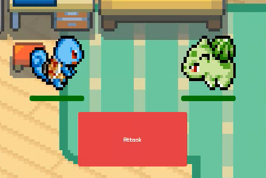
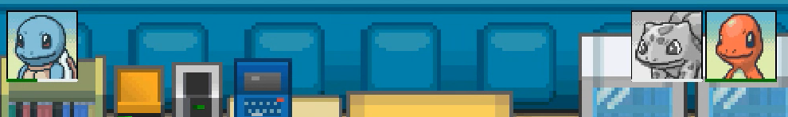

# Pokemon RPG Game

## An RPG Game created with HTML, CSS, JavaScript, and Jquery

To start the game choose a pokemon from the table.

You can choose from:

* Squirtle
* Charmander
* Bulbasaur

After selecting your character the rest of the pokemon will become your enemies, you must select which one you'd like to battle first.

To select an enemy click on their portrait and they will be sent out against your pokemon

Then attack your opponent until their health drops to 0!

When you defeat an enemy their portrait will turn grey and you can select your next enemy to battle.

Once all enemies are defeated you win!